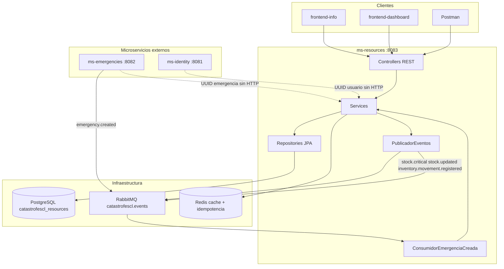
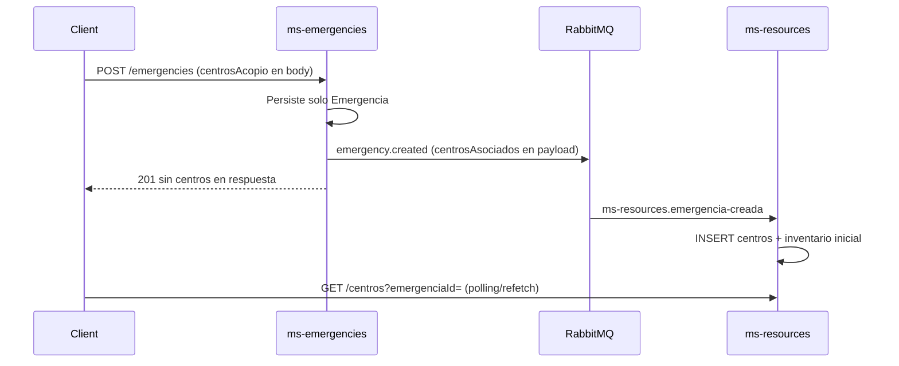
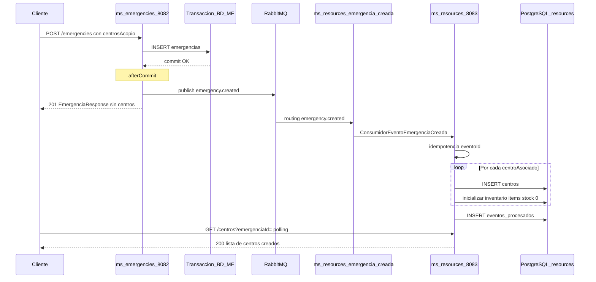
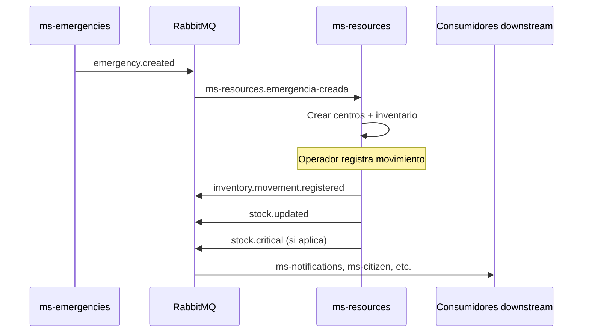

# Análisis integral — ms-resources (Operaciones de Recursos)

**Generado:** 2026-05-29  
**Última actualización:** 2026-05-29 (iteración Fase 2c)  
**Versión del microservicio:** Fase 2c — ~98 % del plan Fase 2  
**Puerto local:** 8083  
**Java:** 21 | **Spring Boot:** 3.4  

### Resumen ejecutivo (última iteración — Fase 2c)

| Área | Entregado |
|------|-----------|
| **BD** | Flyway V8–V12: `categorias`, inventario por `item_catalogo_id`, cantidades **BIGINT** |
| **API** | `GET/POST/PATCH /categorias`, `POST /catalogo/items`, inventario por ítem, `GET .../resumen-categorias` |
| **Movimientos** | `POST .../movimientos` con `itemCatalogoId` + `cantidad` (long) |
| **Eventos** | `stock.*` v1.1 con `itemCatalogoId` |
| **Documentación** | §2.6 flujo RabbitMQ `emergency.created` (guía extensa) |
| **Tests** | Unitarios OK; `InventarioIntegracionTest` (Testcontainers + Docker) |

---

## Tabla de contenidos

1. [Función y responsabilidades](#1-función-y-responsabilidades)
2. [Arquitectura y relaciones externas](#2-arquitectura-y-relaciones-externas)
3. [Estructura del proyecto](#3-estructura-del-proyecto)
4. [Modelo de datos y relaciones](#4-modelo-de-datos-y-relaciones)
5. [Servicios y lógica de negocio](#5-servicios-y-lógica-de-negocio)
6. [Endpoints REST](#6-endpoints-rest)
7. [Seguridad y RBAC](#7-seguridad-y-rbac)
8. [Mensajería RabbitMQ](#8-mensajería-rabbitmq)
9. [Configuración y requisitos previos](#9-configuración-y-requisitos-previos)
10. [Guía de pruebas con Postman](#10-guía-de-pruebas-con-postman)
11. [Excepciones y formato RFC 7807](#11-excepciones-y-formato-rfc-7807)
12. [Tests existentes y gaps](#12-tests-existentes-y-gaps)

---

## 1. Función y responsabilidades

### 1.1 Rol en CatástrofesCL

**ms-resources** es el microservicio de **Operaciones de Recursos** dentro de la plataforma CatástrofesCL. Constituye el núcleo operativo para la gestión de recursos humanitarios durante catástrofes naturales en Chile. Administra centros de acopio, inventario por categorías, criticidad de stock y datos geoespaciales para mapas públicos.

Corresponde a la **Fase 2** del plan de implementación del proyecto (~90 % completada tras Fase 2b).

### 1.2 Responsabilidades concretas

| Área | Descripción |
|------|-------------|
| **Centros de acopio** | Creación, consulta, actualización y geolocalización con PostGIS |
| **Inventario** | Stock por ítem de catálogo (`item_catalogo_id`), agregación por categoría maestra |
| **Motor de criticidad** | Cálculo automático AGOTADO → CRÍTICO → NORMAL → ABUNDANTE → SOBRESTOCK |
| **Operadores** | Asignación de operadores a centros (referencia UUID a ms-identity) |
| **Catálogo de ítems** | Referencia de productos por categoría (semilla en BD) |
| **Mapas públicos** | GeoJSON FeatureCollection optimizado para Leaflet |
| **KPIs y sugerencias** | Métricas agregadas y redistribución geoespacial entre centros |
| **Integración asíncrona** | Consume `emergency.created`; publica eventos de stock |

### 1.3 Stack tecnológico

| Componente | Tecnología |
|------------|------------|
| Framework | Spring Boot 3.4 |
| Lenguaje | Java 21 |
| Persistencia | Spring Data JPA + PostgreSQL 15 + PostGIS |
| Migraciones | Flyway (V1–V12) |
| Geoespacial | Hibernate Spatial + JTS |
| Cache | Redis (Spring Cache) |
| Mensajería | Spring AMQP (RabbitMQ) |
| Seguridad | Spring Security + Firebase Admin SDK (prod) / headers dev |
| API Docs | SpringDoc OpenAPI 3 |
| Validación | Jakarta Bean Validation |
| Build | Maven |

### 1.4 Lo que NO hace este microservicio

- No realiza llamadas HTTP síncronas a otros microservicios.
- No gestiona donaciones, transferencias ni emergencias directamente (solo consume eventos).
- No genera tokens JWT propios (solo valida Firebase ID Tokens o headers dev).
- No implementa inventario solo por categoría (evolucionó a granular por ítem en Fase 2c, [DEC-012]).

### 1.5 Historial de iteraciones

| Iteración | Fecha | Alcance | Referencia |
|-----------|-------|---------|------------|
| **Fase 2a (MVP)** | 2026-05-29 | Scaffold, Flyway V1–V4, CRUD `/centros`, inventario por categoría, consumidor `emergency.created`, limpieza centros demo en ms-emergencies | [ARR-011], [DEC-011] |
| **Fase 2b** | 2026-05-29 | Flyway V5–V7, eventos `stock.*` / `inventory.movement.registered`, catálogo, operadores, map-data, KPIs, sugerencias, cache Redis | [ARR-012] |
| **Fase 2c** | 2026-05-29 | Flyway V8–V12, `categorias`, inventario por ítem BIGINT, API categorías/catálogo, doc RabbitMQ §2.6, tests integración | [DEC-012] |

---

## 2. Arquitectura y relaciones externas

### 2.1 Capas internas

El microservicio sigue arquitectura en capas estricta:

```
Controller → Service → Repository → Entity
                ↓
         PublicadorEventos / Cache Redis
```

### 2.2 Diagrama de flujo



### 2.3 Dependencias con otros microservicios

| Relación | Tipo | Detalle |
|----------|------|---------|
| ms-emergencies → ms-resources | RabbitMQ | Evento `emergency.created` crea centros con `emergencia_id` (sin persistencia local en ms-emergencies desde [ARR-011]) |
| ms-resources → downstream | RabbitMQ | Publica `stock.critical`, `stock.updated`, `inventory.movement.registered` |
| ms-identity | Referencia lógica | UUIDs de `usuarioId` y `creadoPorUsuarioId` sin validación remota |
| frontend-info | HTTP vía gateway | Rutas públicas: `/centros-acopio`, `/catalogo/items`; refetch centros tras declarar emergencia |
| frontend-dashboard | HTTP consumidor | Endpoints autenticados con RBAC |

### 2.4 Integración con ms-emergencies (migración de centros)

Desde [ARR-011], los centros de acopio **ya no se persisten** en ms-emergencies (`centros_acopio_emergencia` eliminada; Flyway V4 en ms-emergencies). El flujo canónico es:



Implicaciones para integradores:

- `POST /emergencies` **no devuelve** `centrosAcopio` en `EmergenciaResponse`.
- Eliminados en ms-emergencies: `GET /emergencies/active/centers`, `GET /emergencies/{id}/centers`.
- El frontend debe consultar ms-resources (o gateway `/centros-acopio?emergenciaId=`) con **retry/polling** por latencia del consumidor (~1–5 s). Ver `docs/integracion-frontend-centros.md`.

### 2.5 Gateway (referencia)

Rutas de ejemplo en `infra/gateway-routes.example.yml`:

| Ruta gateway (frontend) | Destino ms-resources |
|-------------------------|----------------------|
| `/centros-acopio/**` | `/centros/**` (rewrite) |
| `/inventario/**` | `/inventario/**` |
| `/catalogo/**` | `/catalogo/**` |

### 2.6 Creación de centros vía RabbitMQ (`emergency.created`) — guía detallada

Esta sección explica **paso a paso** cómo un centro de acopio nace en ms-resources cuando una autoridad declara una emergencia en ms-emergencies, qué datos viajan en el mensaje, cómo se evitan duplicados y cómo **agregar stock después** mediante la API REST.

#### 2.6.1 Visión general del flujo

ms-emergencies **no persiste** centros de acopio en su base de datos ([ARR-011]). Solo incluye los datos de creación en el evento `emergency.created`. ms-resources es el **único dueño** de la tabla `centros` y del inventario inicial.



#### 2.6.2 Publicación del evento (lado ms-emergencies)

Archivo: `ms-emergencies/.../ServicioEmergencias.java`, método `declarar`.

1. Se persiste la entidad `Emergencia` en la BD local.
2. Se construye `EmergenciaCreadaEvento` con `eventoId` (UUID nuevo), metadatos (`versionEvento: "1.0"`, `fuente: "ms-emergencies"`) y `centrosAsociados[]` mapeados desde el body HTTP.
3. La publicación a RabbitMQ ocurre en **`afterCommit`** para que el consumidor nunca vea una emergencia que luego se revierte por rollback.

**Importante:** la respuesta HTTP `201` llega al cliente **antes** de que ms-resources termine de crear los centros (latencia típica 1–5 s).

#### 2.6.3 Contrato del payload JSON

Clase consumida: `EmergenciaCreadaEvento` + `CentroAsociadoEnEventoDto`.

| Campo evento | Tipo | Descripción |
|--------------|------|-------------|
| `eventoId` | UUID | Identificador único del mensaje (idempotencia) |
| `emergenciaId` | UUID | FK lógica a ms-emergencies |
| `region` | string | Región de la emergencia (se copia al centro) |
| `declaradaPorUsuarioId` | UUID | Usuario que declaró (→ `creado_por_usuario_id`) |
| `centrosAsociados` | array | Lista de centros a crear |

| Campo por centro (`centrosAsociados[]`) | Tipo | ¿Presente hoy? |
|----------------------------------------|------|----------------|
| `nombre` | string | Sí |
| `longitud`, `latitud` | double | Sí |
| `capacidadEstimada` | int | Sí (opcional) |
| `direccion` | string | **No** |
| `comuna` | string | **No** |
| `horario` | string | **No** |

El routing key va **solo** en metadatos AMQP (`emergency.created`), no en el cuerpo JSON (evita `UnrecognizedPropertyException`, ver [ARR-009]).

#### 2.6.4 Consumo en ms-resources

Archivos clave:

- `mensajeria/ConsumidorEventoEmergenciaCreada.java` — `@RabbitListener` en cola `ms-resources.emergencia-creada`.
- `service/ServicioProcesamientoEmergenciaCreada.java` — lógica de idempotencia y bucle de creación.
- `service/ServicioCentros.crearDesdeEvento` — INSERT centro + `inicializarInventarioCentro`.

**Pasos del consumidor:**

1. Si `eventoId` es nulo → se ignora el mensaje.
2. Si `eventos_procesados` ya contiene `eventoId` → return (idempotencia BD).
3. INSERT en `eventos_procesados` (reserva); si hay carrera (`DataIntegrityViolationException`) → return.
4. Por cada elemento de `centrosAsociados`: llamar `crearDesdeEvento`.
5. Marcar Redis `processed:emergency.created:{eventoId}` TTL 24 h.

**Deduplicación de centro:** `existsByEmergenciaIdAndNombre` — si ya existe un centro con el mismo nombre en la misma emergencia, se omite (reproceso parcial seguro).

**Inventario inicial (Fase 2c):** una fila por cada `catalogo_items.activo = true`, todas con `stock_actual = 0` y `estado_criticidad = AGOTADO`.

#### 2.6.5 Infraestructura RabbitMQ

| Elemento | Valor |
|----------|-------|
| Exchange | `catastrofescl.events` (topic) |
| Routing key | `emergency.created` |
| Cola ms-resources | `ms-resources.emergencia-creada` |
| DLQ | `ms-resources.emergencia-creada.dlq` |
| Reintentos | Hasta 3; luego mensaje a DLQ |

#### 2.6.6 Agregar stock **después** de la creación vía cola

Tras el consumo, el centro existe con inventario en cero. Para cargar recursos:

```
POST /centros/{centroId}/inventario/movimientos
Authorization: INVENTARIO_GESTIONAR (Operador+)
```

Body (Fase 2c — por ítem):

```json
{
  "itemCatalogoId": "uuid-del-item",
  "tipoMovimiento": "INGRESO",
  "cantidad": 500
}
```

Cada `INGRESO` incrementa `stock_actual`, recalcula criticidad, persiste en `movimientos_inventario` y publica `inventory.movement.registered`, `stock.updated` y opcionalmente `stock.critical`.

Vista agregada por categoría (dashboard):

```
GET /centros/{centroId}/inventario/resumen-categorias
```

#### 2.6.7 Fallos, latencia y polling

| Escenario | Comportamiento |
|-----------|----------------|
| Cliente consulta centros antes del consumidor | `GET /centros?emergenciaId=` devuelve lista vacía o incompleta → **reintentar** cada 1–2 s (ver `docs/integracion-frontend-centros.md`) |
| Consumidor falla 3 veces | Mensaje en DLQ; centros no creados hasta replay manual |
| Evento reprocesado (mismo `eventoId`) | Ignorado por idempotencia |
| Mismo centro en reproceso distinto evento | Omitido por `(emergenciaId, nombre)` |

#### 2.6.8 Posibilidades de mejora (no implementadas aún)

| Mejora | Beneficio |
|--------|-----------|
| Enriquecer `CentroAsociadoEnEventoDto` con `direccion`, `comuna`, `horario` | Centros más completos sin PATCH posterior |
| `correlacionId` por centro en el evento | Trazabilidad fina en logs y dashboards |
| Evento saliente `center.created` desde ms-resources | Notificar a ms-notifications / dashboard en tiempo real |
| Transacción independiente por centro en el consumidor | Un centro mal formado no bloquea el resto del lote |
| Métricas de lag + alertas si cola > N mensajes | Operaciones proactivas |
| Replay documentado desde DLQ | Recuperación ante fallos de PostGIS o BD |

---


## 3. Estructura del proyecto

```
ms-resources/
├── Dockerfile
├── pom.xml
├── ANALISIS_MS_RESOURCES.md          ← este documento
└── src/
    ├── main/
    │   ├── java/cl/catastrofescl/resources/
    │   │   ├── RecursosApplication.java
    │   │   ├── controller/           # 3 controllers, 14 endpoints
    │   │   │   ├── ControladorCentros.java
    │   │   │   ├── ControladorInventario.java
    │   │   │   └── ControladorCatalogoItems.java
    │   │   ├── service/              # 9 servicios + PublicadorEventos + 2 mapeadores
    │   │   │   ├── ServicioCentros.java
    │   │   │   ├── ServicioInventario.java
    │   │   │   ├── ServicioCatalogoItems.java
    │   │   │   ├── ServicioMapData.java
    │   │   │   ├── ServicioKpis.java
    │   │   │   ├── ServicioOperadoresCentro.java
    │   │   │   ├── ServicioSugerenciasRedistribucion.java
    │   │   │   ├── ServicioProcesamientoEmergenciaCreada.java
    │   │   │   ├── PublicadorEventos.java
    │   │   │   ├── MapeadorCentros.java
    │   │   │   └── GeometriaMapper.java
    │   │   ├── repository/           # 6 repositorios JPA
    │   │   ├── entity/               # 6 entidades + 4 enums
    │   │   ├── dto/
    │   │   │   ├── request/          # 5 DTOs entrada
    │   │   │   ├── response/         # 10 DTOs salida
    │   │   │   ├── CoordenadaDto.java
    │   │   │   └── GeoJsonPuntoDto.java
    │   │   ├── event/                # 4 eventos + EventoDominio
    │   │   ├── mensajeria/           # Consumidor emergency.created
    │   │   ├── config/               # Seguridad, RabbitMQ, Cache, OpenAPI
    │   │   ├── seguridad/            # Filtros Firebase/dev, RBAC
    │   │   └── exception/            # 6 excepciones + advice global
    │   └── resources/
    │       ├── application.yml
    │       ├── application-dev.yml
    │       ├── application-prod.yml
    │       ├── rbac/permisos-por-rol-resources.yml
    │       └── db/migration/         # V1–V7
    └── test/
        ├── java/.../service/         # 4 tests unitarios
        └── resources/application-test.yml
```

### Resumen por paquete

| Paquete | Archivos clave | Responsabilidad |
|---------|----------------|-----------------|
| `controller/` | 3 clases | Exposición HTTP, validación `@Valid`, `@PreAuthorize` |
| `service/` | 10 clases | Lógica de negocio, cache, publicación de eventos |
| `repository/` | 6 interfaces | Acceso a datos JPA + queries PostGIS nativas |
| `entity/` | 6 entidades, 4 enums | Mapeo JPA a tablas PostgreSQL |
| `dto/` | 17 clases | Contratos request/response de la API |
| `event/` | 5 clases | Eventos de dominio para RabbitMQ |
| `mensajeria/` | 1 clase | Consumidor de `emergency.created` |
| `config/` | 8 clases | Beans de infraestructura (`CacheConfig`, RabbitMQ, Redis, Seguridad, OpenAPI) |
| `seguridad/` | 6 clases | Autenticación y autorización |
| `exception/` | 7 clases | Errores de dominio + RFC 7807 |

---

## 4. Modelo de datos y relaciones

### 4.1 Diagrama ER lógico

```
categorias (1) ──< catalogo_items (N)
catalogo_items (1) ──< inventario (N)     UNIQUE (centro_id, item_catalogo_id)
centros (1) ──< inventario (N)
centros (1) ──< operadores_centro (N)     UNIQUE (centro_id, usuario_id)
centros (1) ──< movimientos_inventario (N)
inventario (1) ──< movimientos_inventario (N)
eventos_procesados                        → idempotencia RabbitMQ
```

**Nota:** El modelo JPA no usa anotaciones `@ManyToOne` / `@OneToMany`. Las relaciones se modelan con columnas `UUID` y FK en SQL.

### 4.2 Tablas Flyway

| Versión | Archivo | Contenido |
|---------|---------|-----------|
| V1 | `V1__enable_postgis.sql` | Extensiones `postgis` y `pgcrypto` |
| V2 | `V2__create_centros_table.sql` | Tabla `centros` + índice GIST en coordenadas |
| V3 | `V3__create_inventario_por_categoria.sql` | Tabla `inventario` + UNIQUE(centro_id, categoria) |
| V4 | `V4__create_eventos_procesados.sql` | Tabla `eventos_procesados` (idempotencia) |
| V5 | `V5__create_catalogo_items.sql` | Tabla `catalogo_items` + 11 ítems semilla |
| V6 | `V6__create_operadores_centro.sql` | Tabla `operadores_centro` |
| V7 | `V7__create_movimientos_inventario.sql` | Tabla `movimientos_inventario` + FKs |
| V8 | `V8__create_categorias.sql` | Tabla `categorias` + 6 categorías semilla |
| V9 | `V9__catalogo_items_categoria_id.sql` | FK `catalogo_items.categoria_id` |
| V10 | `V10__inventario_por_item_bigint.sql` | Inventario por `item_catalogo_id`, cantidades BIGINT |
| V11 | `V11__movimientos_item_bigint.sql` | `item_catalogo_id` en movimientos, BIGINT |
| V12 | `V12__cleanup_catalogo_legacy.sql` | Drop columna legacy `catalogo_items.categoria` |

### 4.3 Entidades JPA

#### Centro (`centros`)

| Campo | Tipo | Descripción |
|-------|------|-------------|
| `id` | UUID | PK |
| `nombre` | VARCHAR(200) | Nombre del centro |
| `direccion` | VARCHAR(500) | Dirección textual |
| `coordenadas` | geography(Point,4326) | Ubicación PostGIS |
| `region`, `comuna` | VARCHAR(100) | Ubicación administrativa |
| `capacidad` | INTEGER | Capacidad estimada |
| `horario` | VARCHAR(200) | Horario de atención |
| `estado` | ENUM | ACTIVO, INACTIVO, SATURADO, CERRADO |
| `emergencia_id` | UUID | Referencia lógica a ms-emergencies |
| `creado_por_usuario_id` | UUID | Referencia lógica a ms-identity |
| `creado_en`, `actualizado_en` | TIMESTAMPTZ | Auditoría temporal |

#### Inventario (`inventario`) — Fase 2c

| Campo | Tipo | Descripción |
|-------|------|-------------|
| `id` | UUID | PK |
| `centro_id` | UUID | FK → centros (CASCADE) |
| `item_catalogo_id` | UUID | FK → catalogo_items |
| `stock_actual` | **BIGINT** | Cantidad actual del ítem |
| `umbral_minimo` | **BIGINT** | Default: 10 |
| `umbral_optimo` | **BIGINT** | Default: 50 |
| `umbral_maximo` | **BIGINT** | Default: 200 |
| `estado_criticidad` | ENUM | Calculado automáticamente por ítem |
| `actualizado_en` | TIMESTAMPTZ | Última modificación |

**Constraint:** `UNIQUE(centro_id, item_catalogo_id)`.

#### Categoria (`categorias`)

| Campo | Tipo | Descripción |
|-------|------|-------------|
| `id` | UUID | PK |
| `codigo` | VARCHAR(50) UK | Ej. `ALIMENTOS` |
| `nombre` | VARCHAR(100) | Nombre legible |
| `activo` | BOOLEAN | Visible en catálogo |
| `orden` | INT | Orden en UI |

#### Otras entidades

| Entidad | Tabla | Propósito |
|---------|-------|-----------|
| `ItemCatalogo` | `catalogo_items` | Ítems de referencia (FK `categoria_id`) |
| `MovimientoInventario` | `movimientos_inventario` | Trazabilidad de ingresos/egresos |
| `OperadorCentro` | `operadores_centro` | Asignación operador ↔ centro |
| `EventoProcesado` | `eventos_procesados` | Registro de eventos RabbitMQ ya procesados |

**Semilla V5 (`catalogo_items`):** 11 ítems — Arroz (KG), Agua embotellada, Jabón, Pañales, Palas, Martillos, Frazadas, Carpas, Chaquetas, Zapatos (PAR), Utensilios varios (una entrada por categoría de inventario).

### 4.4 Enums de dominio

#### CategoriaInventario

```
ALIMENTOS | ARTICULOS_HIGIENE | HERRAMIENTAS | MATERIALES | ROPA | ARTICULOS_VARIOS
```

#### EstadoCriticidad (motor de criticidad)

| Estado | Condición |
|--------|-----------|
| AGOTADO | stock = 0 |
| CRITICO | 0 < stock ≤ umbral_minimo |
| NORMAL | umbral_minimo < stock ≤ umbral_optimo |
| ABUNDANTE | umbral_optimo < stock ≤ umbral_maximo |
| SOBRESTOCK | stock > umbral_maximo |

#### EstadoCentro

```
ACTIVO | INACTIVO | SATURADO | CERRADO
```

#### TipoMovimiento

```
INGRESO | EGRESO
```

### 4.5 Referencias lógicas sin FK

| Columna | Microservicio origen | Uso |
|---------|---------------------|-----|
| `centros.emergencia_id` | ms-emergencies | Vincular centro a emergencia |
| `centros.creado_por_usuario_id` | ms-identity | Auditoría de creación |
| `operadores_centro.usuario_id` | ms-identity | Operador asignado |
| `movimientos_inventario.registrado_por_usuario_id` | ms-identity | Quién registró el movimiento |

---

## 5. Servicios y lógica de negocio

### 5.1 ServicioInventario — motor de criticidad

Archivo: `service/ServicioInventario.java`

**Responsabilidades:**
- Inicializar 6 filas de inventario al crear un centro (stock=0, AGOTADO).
- Registrar movimientos INGRESO/EGRESO con validación de stock.
- Recalcular criticidad tras cada movimiento o cambio de umbrales.
- Persistir trazabilidad en `movimientos_inventario`.
- Invalidar cache de map-data y KPIs.
- Publicar eventos RabbitMQ **después del commit** transaccional.

**Umbrales por defecto al crear centro:**

| Umbral | Valor |
|--------|-------|
| Mínimo | 10 |
| Óptimo | 50 |
| Máximo | 200 |

**Lógica de criticidad:**

```java
if (stock == 0) return AGOTADO;
if (stock <= umbralMinimo) return CRITICO;
if (stock <= umbralOptimo) return NORMAL;
if (stock <= umbralMaximo) return ABUNDANTE;
return SOBRESTOCK;
```

### 5.2 ServicioCentros

- **`crear`**: persiste centro + invoca `inicializarInventarioCentro`.
- **`crearDesdeEvento`**: idempotente por `(emergenciaId, nombre)` al consumir `emergency.created`.
- **`listarCercanos`**: query PostGIS `ST_DWithin` + `ST_Distance` con paginación.
- **`actualizar`**: PATCH parcial de campos del centro.

### 5.3 ServicioMapData

- Proyección SQL agregada de criticidad máxima por centro activo.
- Retorna GeoJSON FeatureCollection para Leaflet.
- Cache Redis TTL **60 segundos**.

### 5.4 ServicioKpis

Agrega 4 contadores:
- Centros activos
- Ítems críticos o agotados
- Ítems en sobrestock
- Movimientos en últimas 24 horas

Cache Redis TTL **30 segundos**.

### 5.5 ServicioSugerenciasRedistribucion

- Empareja centros con criticidad AGOTADO/CRÍTICO (demanda) vs ABUNDANTE/SOBRESTOCK (oferta).
- Calcula distancia vía PostGIS `ST_Distance`.
- Cantidad sugerida = `min(deficit, excedente)`.

### 5.6 ServicioOperadoresCentro

- Asignación con unicidad `(centroId, usuarioId)`.
- Lanza `OperadorYaAsignadoException` si duplicado.

### 5.7 ServicioProcesamientoEmergenciaCreada

- Idempotencia dual: tabla `eventos_procesados` + Redis `processed:emergency.created:{eventoId}` (TTL 24h).
- Crea centros asociados desde payload del evento `EmergenciaCreadaEvento`.

### 5.8 ServicioCatalogoItems

- Lista ítems activos con datos de categoría maestra.
- Filtro por `categoriaId` (query param).
- `POST /catalogo/items` (ADMIN): crea ítem e inicializa filas de inventario en todos los centros.
- Cache Redis TTL **300 segundos** (`catalogo-items`).

### 5.11 ServicioCategorias

- CRUD de categorías maestras (`GET` público, `POST/PATCH` solo ADMIN).
- Las 6 categorías iniciales se siembran en V8.

### 5.9 Cache Redis

| Cache | TTL | Servicio |
|-------|-----|----------|
| `map-data` | 60s | `ServicioMapData` |
| `kpis` | 30s | `ServicioKpis` |
| `catalogo-items` | 300s | `ServicioCatalogoItems` |

### 5.10 PublicadorEventos

Archivo: `service/PublicadorEventos.java`

- Serializa eventos de dominio (`EventoDominio`) y publica en el exchange `catastrofescl.events` con la routing key del evento.
- Invocado por `ServicioInventario` **después del commit** (`TransactionSynchronization.afterCommit`) para evitar mensajes huérfanos si falla la transacción.
- Genera `eventoId` UUID por publicación; `correlacionId` = ID del movimiento de inventario.

---

## 6. Endpoints REST

**Base URL:** `http://localhost:8083`  
**Total:** 19 endpoints en 5 controllers.

### 6.0 ControladorCategorias — `/categorias`

| # | Método | Path | Acceso | Descripción |
|---|--------|------|--------|-------------|
| 1 | GET | `/categorias` | Público | Lista categorías activas |
| 2 | POST | `/categorias` | `CATEGORIA_GESTIONAR` | Crea categoría (ADMIN) |
| 3 | PATCH | `/categorias/{id}` | `CATEGORIA_GESTIONAR` | Actualiza categoría (ADMIN) |

### 6.1 ControladorCentros — `/centros`

| # | Método | Path | Acceso | Descripción |
|---|--------|------|--------|-------------|
| 4 | POST | `/centros` | `CENTRO_CREAR` | Crea centro e inicializa inventario por ítems activos |
| 5 | GET | `/centros` | Público | Lista paginada. Query: `emergenciaId`, `page`, `size` |
| 6 | GET | `/centros/cercanos` | Público | Centros cercanos PostGIS |
| 7 | GET | `/centros/map-data` | Público | GeoJSON FeatureCollection (cache 60s) |
| 8 | GET | `/centros/{id}` | Autenticado | Detalle de un centro |
| 9 | PATCH | `/centros/{id}` | `CENTRO_GESTIONAR` | Actualización parcial del centro |
| 10 | GET | `/centros/{id}/inventario` | Autenticado | Inventario por ítem de catálogo |
| 11 | GET | `/centros/{id}/inventario/resumen-categorias` | Autenticado | Stock agregado por categoría |
| 12 | POST | `/centros/{id}/inventario/movimientos` | `INVENTARIO_GESTIONAR` | Ingreso/egreso por `itemCatalogoId` |
| 13 | PATCH | `/centros/{id}/inventario/umbrales` | `INVENTARIO_UMBRALES` | Umbrales por ítem (ADMIN) |
| 14 | POST | `/centros/{id}/operadores` | `CENTRO_ASIGNAR_OPERADOR` | Asigna operador |
| 15 | GET | `/centros/{id}/operadores` | `CENTRO_GESTIONAR` | Lista operadores |

### 6.2 ControladorInventario — `/inventario`

| # | Método | Path | Acceso | Descripción |
|---|--------|------|--------|-------------|
| 16 | GET | `/inventario/sugerencias` | `INVENTARIO_SUGERENCIAS` | Redistribución por ítem/categoría |
| 17 | GET | `/inventario/kpis` | Autenticado | KPIs agregados (cache 30s) |

### 6.3 ControladorCatalogoItems — `/catalogo/items`

| # | Método | Path | Acceso | Descripción |
|---|--------|------|--------|-------------|
| 18 | GET | `/catalogo/items` | Público | Catálogo activo. Query: `categoriaId` |
| 19 | POST | `/catalogo/items` | `CATALOGO_GESTIONAR` | Alta de ítem (ADMIN) |

### 6.4 Endpoints auxiliares (sin autenticación)

| Método | Path | Descripción |
|--------|------|-------------|
| GET | `/actuator/health` | Health check |
| GET | `/actuator/info` | Información de la aplicación |
| GET | `/swagger-ui.html` | Interfaz Swagger UI |
| GET | `/v3/api-docs` | Especificación OpenAPI JSON |

### 6.5 DTOs de entrada (request)

#### CrearCentroRequest — POST `/centros`

```json
{
  "nombre": "string (requerido, max 200)",
  "direccion": "string (opcional, max 500)",
  "coordenadas": { "longitud": -70.6506, "latitud": -33.4372 },
  "region": "string (opcional)",
  "comuna": "string (opcional)",
  "capacidad": 500,
  "horario": "string (opcional)",
  "estado": "ACTIVO"
}
```

#### ActualizarCentroRequest — PATCH `/centros/{id}`

Todos los campos opcionales: `nombre`, `direccion`, `region`, `comuna`, `capacidad`, `horario`, `estado`.

#### SolicitudMovimientoInventarioRequest — POST `/centros/{id}/inventario/movimientos`

```json
{
  "itemCatalogoId": "uuid-del-item-catalogo",
  "tipoMovimiento": "INGRESO",
  "cantidad": 100
}
```

`cantidad` es **long** (BIGINT en BD). Valores `tipoMovimiento`: `INGRESO`, `EGRESO`.

#### ActualizarUmbralesInventarioRequest — PATCH `/centros/{id}/inventario/umbrales`

```json
{
  "itemCatalogoId": "uuid-del-item-catalogo",
  "umbralMinimo": 10,
  "umbralOptimo": 50,
  "umbralMaximo": 200
}
```

Regla: `umbralMinimo <= umbralOptimo <= umbralMaximo`.

#### AsignarOperadorCentroRequest — POST `/centros/{id}/operadores`

```json
{
  "usuarioId": "550e8400-e29b-41d4-a716-446655440000"
}
```

### 6.6 DTOs de salida (response) principales

| DTO | Campos relevantes |
|-----|-------------------|
| `CentroResponse` | id, nombre, coordenadas (GeoJSON Point), estado, emergenciaId |
| `InventarioCategoriaResponse` | categoria, stockActual, umbrales, estadoCriticidad |
| `RespuestaMovimientoInventarioResponse` | categoria, tipoMovimiento, stockAnterior, stockActual, estadoCriticidad |
| `KpisInventarioResponse` | centrosActivos, itemsCriticosOAgotados, itemsSobrestock, movimientosUltimas24h |
| `SugerenciaRedistribucionResponse` | centroOrigen, centroDestino, distanciaMetros, cantidadSugerida |
| `ColeccionMapaCentrosResponse` | GeoJSON FeatureCollection |
| `OperadorCentroResponse` | id, centroId, usuarioId, asignadoEn |
| `ItemCatalogoResponse` | id, nombre, categoria, unidadMedida |

---

## 7. Seguridad y RBAC

### 7.1 Flujo de autenticación

**Producción:** Firebase ID Token → `FiltroAutenticacionFirebase` → Spring Security → `@PreAuthorize`

**Desarrollo** (`MS_RESOURCES_AUTH_DEV_MODE=true`): Headers `X-Dev-*` → `FiltroAutenticacionDev` → permisos desde YAML local.

### 7.2 Matriz RBAC

Archivo: `src/main/resources/rbac/permisos-por-rol-resources.yml`

| Rol | Permisos |
|-----|----------|
| ADMINISTRADOR | CENTRO_CREAR, CENTRO_GESTIONAR, CENTRO_ASIGNAR_OPERADOR, INVENTARIO_GESTIONAR, INVENTARIO_UMBRALES, INVENTARIO_SUGERENCIAS, CATEGORIA_GESTIONAR, CATALOGO_GESTIONAR |
| AUTORIDAD | CENTRO_CREAR, CENTRO_GESTIONAR, CENTRO_ASIGNAR_OPERADOR, INVENTARIO_GESTIONAR, INVENTARIO_SUGERENCIAS |
| OPERADOR | INVENTARIO_GESTIONAR |
| PARTICULAR | (ninguno) |
| VOLUNTARIO | (ninguno) |

**Alias Firebase aceptados:** `ADMIN` → ADMINISTRADOR, `AUTHORITY` → AUTORIDAD, `OPERATOR` → OPERADOR, etc.

### 7.3 Rutas públicas (sin token)

Configuradas en `application.yml` bajo `catastrofescl.auth.public-paths`:

- `/categorias` (GET listado)
- `/centros` (GET listado)
- `/centros/cercanos`
- `/centros/map-data`
- `/catalogo/items`
- `/actuator/health`
- Swagger UI y `/v3/api-docs/**`

---

## 8. Mensajería RabbitMQ

### 8.1 Configuración

| Elemento | Valor |
|----------|-------|
| Topic Exchange | `catastrofescl.events` |
| Dead Letter Exchange | `catastrofescl.dlx` |
| Cola consumo | `ms-resources.emergencia-creada` |
| DLQ | `ms-resources.emergencia-creada.dlq` |

### 8.2 Consumidor

| Evento | Routing key | Origen | Acción |
|--------|-------------|--------|--------|
| `EmergenciaCreadaEvento` | `emergency.created` | ms-emergencies | Crea centros con `emergencia_id` e inicializa inventario |

**Idempotencia:** Tabla `eventos_procesados` + Redis `processed:emergency.created:{eventoId}` (TTL 24h).

**Payload consumido:** `eventoId`, `emergenciaId`, `region`, `declaradaPorUsuarioId`, `centrosAsociados[]` (nombre, lat/lng, capacidadEstimada).

### 8.3 Productores

Publicados por `ServicioInventario` tras cada movimiento de inventario (después del commit):

| Evento | Routing key | Cuándo |
|--------|-------------|--------|
| `MovimientoInventarioRegistradoEvento` | `inventory.movement.registered` | Siempre |
| `StockActualizadoEvento` | `stock.updated` | Siempre |
| `StockCriticoEvento` | `stock.critical` | Solo si **transición** a CRÍTICO o AGOTADO (no en cada movimiento) |

**Metadatos de evento:** `versionEvento: "1.0"`, `fuente: "ms-resources"`, `eventoId`, `correlacionId` (ID del movimiento).

### 8.4 Diagrama de flujo de eventos



---

## 9. Configuración y requisitos previos

### 9.1 Herramientas requeridas

| Herramienta | Versión mínima | Verificación |
|-------------|----------------|--------------|
| Java | 21 | `java -version` |
| Maven | 3.9+ | `mvn -v` |
| Docker Desktop | reciente | `docker --version` |
| PostgreSQL + PostGIS | 15+ | pgAdmin o `SELECT postgis_version();` |
| Postman | cualquiera | Para pruebas manuales |

### 9.2 Recursos locales

| Recurso | Valor por defecto |
|---------|-------------------|
| URL base | `http://localhost:8083` |
| Base de datos | `catastrofescl_resources` |
| Usuario BD | `catastrofescl` / `catastrofescl` |
| Redis | `localhost:6379` |
| RabbitMQ | `localhost:5672` (Management UI: `localhost:15672`) |
| Swagger | `http://localhost:8083/swagger-ui.html` |
| Health | `http://localhost:8083/actuator/health` |

### 9.3 Crear base de datos (pgAdmin)

1. Conectar a PostgreSQL local en pgAdmin.
2. Crear rol `catastrofescl` si no existe (misma clave que en `.env`).
3. Crear base de datos `catastrofescl_resources` con owner `catastrofescl`.
4. En Query Tool de esa base, ejecutar:

```sql
CREATE EXTENSION IF NOT EXISTS postgis;
CREATE EXTENSION IF NOT EXISTS "pgcrypto";

GRANT CONNECT, TEMP ON DATABASE catastrofescl_resources TO catastrofescl;
GRANT USAGE, CREATE ON SCHEMA public TO catastrofescl;
GRANT ALL PRIVILEGES ON ALL TABLES IN SCHEMA public TO catastrofescl;
GRANT ALL PRIVILEGES ON ALL SEQUENCES IN SCHEMA public TO catastrofescl;
ALTER DEFAULT PRIVILEGES IN SCHEMA public GRANT ALL ON TABLES TO catastrofescl;
ALTER DEFAULT PRIVILEGES IN SCHEMA public GRANT ALL ON SEQUENCES TO catastrofescl;
```

Flyway aplicará automáticamente V1–V7 al iniciar la aplicación.

### 9.4 Levantar el microservicio

**Opción A — Maven local** (desde `ms-resources/`):

```powershell
mvn spring-boot:run
```

**Opción B — Docker Compose** (desde raíz del repositorio):

```powershell
docker compose up rabbitmq redis ms-resources
```

Variables de entorno relevantes:

| Variable | Default dev | Descripción |
|----------|-------------|-------------|
| `MS_RESOURCES_DB_URL` | `jdbc:postgresql://localhost:5432/catastrofescl_resources` | JDBC URL |
| `MS_RESOURCES_AUTH_DEV_MODE` | `true` | Habilita headers X-Dev-* |
| `FIREBASE_ENABLED` | `false` | Desactiva Firebase en local |
| `RABBITMQ_HOST` | `localhost` | Host RabbitMQ |
| `REDIS_HOST` | `localhost` | Host Redis |

### 9.5 Verificar que funciona

```powershell
curl http://localhost:8083/actuator/health
curl http://localhost:8083/catalogo/items
```

Respuesta esperada de health: `{"status":"UP"}`.

---

## 10. Guía de pruebas con Postman

### 10.1 Configuración de entorno Postman

Crear un **Environment** llamado `ms-resources-local` con estas variables:

| Variable | Valor inicial | Descripción |
|----------|---------------|-------------|
| `baseUrl` | `http://localhost:8083` | URL base del microservicio |
| `centroId` | *(vacío)* | Se llena tras crear centro |
| `devUid` | `dev-admin-001` | UID simulado Firebase |
| `devUsuarioId` | `550e8400-e29b-41d4-a716-446655440000` | UUID interno de prueba |
| `operadorUsuarioId` | `660e8400-e29b-41d4-a716-446655440001` | UUID para asignar operador |

### 10.2 Autenticación en modo dev

En entorno local, `MS_RESOURCES_AUTH_DEV_MODE=true` activa el filtro dev. Para endpoints protegidos, agregar estos headers:

| Header | Valor ejemplo | Obligatorio |
|--------|---------------|-------------|
| `X-Dev-Firebase-Uid` | `{{devUid}}` | Sí |
| `X-Dev-Roles` | `ADMINISTRADOR` | Sí |
| `X-Dev-Usuario-Id` | `{{devUsuarioId}}` | Opcional (recomendado) |

**Presets de rol para Postman:**

| Preset | X-Dev-Roles | Permisos clave |
|--------|-------------|----------------|
| Administrador | `ADMINISTRADOR` o `ADMIN` | Todos, incluye umbrales |
| Autoridad | `AUTORIDAD` o `AUTHORITY` | Crear centros, inventario, operadores |
| Operador | `OPERADOR` o `OPERATOR` | Solo movimientos de inventario |

**Tip:** Crear un **Pre-request Script** a nivel de colección para inyectar headers automáticamente:

```javascript
pm.request.headers.add({ key: "X-Dev-Firebase-Uid", value: pm.environment.get("devUid") });
pm.request.headers.add({ key: "X-Dev-Roles", value: "ADMINISTRADOR" });
pm.request.headers.add({ key: "X-Dev-Usuario-Id", value: pm.environment.get("devUsuarioId") });
```

Para requests públicos, no agregar headers de autenticación.

### 10.3 Flujo A — Endpoints públicos (sin autenticación)

Ejecutar en orden. Ninguno requiere headers.

#### A.1 Health check

```
GET {{baseUrl}}/actuator/health
```

Respuesta esperada: `200 OK`, body `{"status":"UP"}`.

#### A.2 Catálogo de ítems

```
GET {{baseUrl}}/catalogo/items
```

Respuesta esperada: `200 OK`, array con 11 ítems semilla (Arroz, Agua, Jabón, etc.).

Filtrar por categoría:

```
GET {{baseUrl}}/catalogo/items?categoria=ALIMENTOS
```

#### A.3 Listar centros

```
GET {{baseUrl}}/centros?page=0&size=10
```

Respuesta esperada: `200 OK`, objeto paginado Spring (`content`, `totalElements`, `totalPages`).

Filtrar por emergencia:

```
GET {{baseUrl}}/centros?emergenciaId={{emergenciaId}}&page=0&size=10
```

#### A.4 Centros cercanos (PostGIS)

Coordenadas de referencia: Plaza de la Constitución, Santiago.

```
GET {{baseUrl}}/centros/cercanos?lat=-33.4489&lng=-70.6693&radioMetros=10000&page=0&size=20
```

Respuesta esperada: `200 OK`, centros dentro del radio en metros.

#### A.5 Datos para mapa Leaflet

```
GET {{baseUrl}}/centros/map-data
```

Respuesta esperada: `200 OK`, GeoJSON FeatureCollection con propiedades `criticidadMaxima` por centro activo.

---

### 10.4 Flujo B — Ciclo operativo completo (ADMINISTRADOR)

Requiere headers dev de Administrador en todos los pasos.

#### B.1 Crear centro de acopio

```
POST {{baseUrl}}/centros
Content-Type: application/json
X-Dev-Firebase-Uid: {{devUid}}
X-Dev-Roles: ADMINISTRADOR
X-Dev-Usuario-Id: {{devUsuarioId}}
```

Body:

```json
{
  "nombre": "Centro Acopio Providencia",
  "direccion": "Av. Providencia 1234",
  "coordenadas": {
    "longitud": -70.6106,
    "latitud": -33.4372
  },
  "region": "Región Metropolitana",
  "comuna": "Providencia",
  "capacidad": 500,
  "horario": "08:00-20:00",
  "estado": "ACTIVO"
}
```

Respuesta esperada: `201 Created`, header `Location: /centros/{id}`.

**Script Postman (Tests tab)** para guardar el ID:

```javascript
if (pm.response.code === 201) {
    const body = pm.response.json();
    pm.environment.set("centroId", body.id);
}
```

#### B.2 Obtener detalle del centro

```
GET {{baseUrl}}/centros/{{centroId}}
X-Dev-Firebase-Uid: {{devUid}}
X-Dev-Roles: ADMINISTRADOR
```

Respuesta esperada: `200 OK`, objeto `CentroResponse` con coordenadas GeoJSON.

#### B.3 Consultar inventario inicial

```
GET {{baseUrl}}/centros/{{centroId}}/inventario
X-Dev-Firebase-Uid: {{devUid}}
X-Dev-Roles: ADMINISTRADOR
```

Respuesta esperada: `200 OK`, array de **6 categorías**, todas con `stockActual: 0` y `estadoCriticidad: "AGOTADO"`.

#### B.4 Registrar ingreso de stock

```
POST {{baseUrl}}/centros/{{centroId}}/inventario/movimientos
Content-Type: application/json
X-Dev-Firebase-Uid: {{devUid}}
X-Dev-Roles: ADMINISTRADOR
X-Dev-Usuario-Id: {{devUsuarioId}}
```

Body:

```json
{
  "categoria": "ALIMENTOS",
  "tipoMovimiento": "INGRESO",
  "cantidad": 100
}
```

Respuesta esperada: `200 OK`:

```json
{
  "categoria": "ALIMENTOS",
  "tipoMovimiento": "INGRESO",
  "cantidad": 100,
  "stockAnterior": 0,
  "stockActual": 100,
  "estadoCriticidad": "ABUNDANTE"
}
```

Verificar en RabbitMQ Management (`http://localhost:15672`) que se publicaron mensajes en el exchange `catastrofescl.events`.

#### B.5 Consultar KPIs

```
GET {{baseUrl}}/inventario/kpis
X-Dev-Firebase-Uid: {{devUid}}
X-Dev-Roles: ADMINISTRADOR
```

Respuesta esperada: `200 OK`:

```json
{
  "centrosActivos": 1,
  "itemsCriticosOAgotados": 5,
  "itemsSobrestock": 0,
  "movimientosUltimas24h": 1
}
```

#### B.6 Actualizar umbrales (solo ADMINISTRADOR)

```
PATCH {{baseUrl}}/centros/{{centroId}}/inventario/umbrales
Content-Type: application/json
X-Dev-Firebase-Uid: {{devUid}}
X-Dev-Roles: ADMINISTRADOR
```

Body:

```json
{
  "categoria": "ALIMENTOS",
  "umbralMinimo": 20,
  "umbralOptimo": 80,
  "umbralMaximo": 300
}
```

Respuesta esperada: `200 OK`, `estadoCriticidad` recalculado según stock actual.

#### B.7 Actualizar datos del centro

```
PATCH {{baseUrl}}/centros/{{centroId}}
Content-Type: application/json
X-Dev-Firebase-Uid: {{devUid}}
X-Dev-Roles: ADMINISTRADOR
```

Body:

```json
{
  "capacidad": 600,
  "estado": "SATURADO",
  "horario": "07:00-22:00"
}
```

#### B.8 Asignar operador

```
POST {{baseUrl}}/centros/{{centroId}}/operadores
Content-Type: application/json
X-Dev-Firebase-Uid: {{devUid}}
X-Dev-Roles: ADMINISTRADOR
```

Body:

```json
{
  "usuarioId": "{{operadorUsuarioId}}"
}
```

Respuesta esperada: `200 OK` o `201 Created` con datos de la asignación.

#### B.9 Listar operadores del centro

```
GET {{baseUrl}}/centros/{{centroId}}/operadores
X-Dev-Firebase-Uid: {{devUid}}
X-Dev-Roles: ADMINISTRADOR
```

#### B.10 Sugerencias de redistribución

Para obtener sugerencias útiles, crear un **segundo centro** con stock bajo y otro con stock alto en la misma categoría, luego:

```
GET {{baseUrl}}/inventario/sugerencias?categoria=ALIMENTOS&limite=5
X-Dev-Firebase-Uid: {{devUid}}
X-Dev-Roles: ADMINISTRADOR
```

Respuesta esperada: `200 OK`, array de pares origen→destino con `distanciaMetros` y `cantidadSugerida`.

---

### 10.5 Flujo C — Validación RBAC (OPERADOR)

Usar headers con rol OPERADOR:

```
X-Dev-Firebase-Uid: dev-operador-001
X-Dev-Roles: OPERADOR
X-Dev-Usuario-Id: {{operadorUsuarioId}}
```

| Request | Resultado esperado |
|---------|-------------------|
| `POST /centros/{id}/inventario/movimientos` (INGRESO) | `200 OK` |
| `POST /centros` | `403 Forbidden`, errorCode `ACCESS_DENIED` |
| `PATCH /centros/{id}/inventario/umbrales` | `403 Forbidden` |
| `GET /inventario/sugerencias?categoria=ALIMENTOS` | `403 Forbidden` |
| `POST /centros/{id}/operadores` | `403 Forbidden` |

Probar también endpoint protegido **sin headers**:

```
GET {{baseUrl}}/centros/{{centroId}}
```

Resultado esperado: `401 Unauthorized`, errorCode `UNAUTHENTICATED`.

---

### 10.6 Flujo D — Casos de error

Usar headers de Administrador salvo donde se indique lo contrario.

#### D.1 Centro inexistente

```
GET {{baseUrl}}/centros/00000000-0000-0000-0000-000000000099
X-Dev-Firebase-Uid: {{devUid}}
X-Dev-Roles: ADMINISTRADOR
```

Respuesta esperada: `404 Not Found`:

```json
{
  "type": "https://catastrofescl.cl/errors/center-not-found",
  "title": "Centro no encontrado",
  "status": 404,
  "errorCode": "CENTER_NOT_FOUND",
  "centroId": "00000000-0000-0000-0000-000000000099"
}
```

#### D.2 Egreso con stock insuficiente

Primero verificar stock actual. Luego:

```
POST {{baseUrl}}/centros/{{centroId}}/inventario/movimientos
Content-Type: application/json
```

Body:

```json
{
  "categoria": "ALIMENTOS",
  "tipoMovimiento": "EGRESO",
  "cantidad": 99999
}
```

Respuesta esperada: `409 Conflict`, errorCode `INSUFFICIENT_STOCK`.

#### D.3 Operador duplicado

Ejecutar dos veces el mismo `POST /centros/{id}/operadores` con el mismo `usuarioId`.

Segunda respuesta esperada: `409 Conflict`, errorCode `OPERATOR_ALREADY_ASSIGNED`.

#### D.4 Umbrales inválidos

```
PATCH {{baseUrl}}/centros/{{centroId}}/inventario/umbrales
```

Body:

```json
{
  "categoria": "ALIMENTOS",
  "umbralMinimo": 100,
  "umbralOptimo": 50,
  "umbralMaximo": 200
}
```

Respuesta esperada: `400 Bad Request`, errorCode `VALIDATION_ERROR`.

#### D.5 JSON inválido

```
POST {{baseUrl}}/centros
Content-Type: application/json
```

Body: `{ "nombre": }` (JSON malformado)

Respuesta esperada: `400 Bad Request`, errorCode `INVALID_JSON`.

#### D.6 Validación de campos

```
POST {{baseUrl}}/centros
Content-Type: application/json
```

Body:

```json
{
  "nombre": "",
  "coordenadas": { "longitud": -70.6, "latitud": -33.4 }
}
```

Respuesta esperada: `400 Bad Request` con mapa `errores` por campo.

---

### 10.7 Flujo E — Integración con ms-emergencies (opcional)

Requiere **ms-emergencies** en `:8082`, **ms-resources** en `:8083` y **RabbitMQ** activo.

#### E.1 Declarar emergencia con centros (ms-emergencies)

Headers dev (ms-emergencies):

```
X-Dev-Firebase-Uid: dev-admin-001
X-Dev-Roles: ADMINISTRADOR
```

```
POST http://localhost:8082/emergencies
Content-Type: application/json
```

Body (contrato real `DeclararEmergenciaRequest`):

```json
{
  "tipo": "TERREMOTO",
  "severidad": "ALTA",
  "region": "Metropolitana",
  "epicentro": { "longitud": -70.6693, "latitud": -33.4489 },
  "centrosAcopio": [
    {
      "nombre": "Centro Emergencia RM Norte",
      "ubicacion": { "longitud": -70.65, "latitud": -33.40 },
      "capacidadEstimada": 300
    }
  ]
}
```

Alias JSON aceptado: `centers` en lugar de `centrosAcopio`.

Respuesta esperada: `201 Created` con `id` de emergencia **sin** lista de centros.

**Script Postman (Tests):**

```javascript
if (pm.response.code === 201) {
    pm.environment.set("emergenciaId", pm.response.json().id);
}
```

#### E.2 Verificar centros en ms-resources (polling)

Esperar 2–5 s o reintentar hasta que aparezca el centro:

```
GET {{baseUrl}}/centros?emergenciaId={{emergenciaId}}&page=0&size=10
```

Respuesta esperada: `200 OK`, `content` con al menos un centro (`nombre`: "Centro Emergencia RM Norte"), inventario inicial vía consumidor.

#### E.3 Verificar RabbitMQ

En RabbitMQ Management UI (`http://localhost:15672`, guest/guest):

- Exchange `catastrofescl.events` → binding `emergency.created` → cola `ms-resources.emergencia-creada`
- Mensaje consumido (Ready = 0 en la cola principal)
- Tras un movimiento de inventario en ms-resources: mensajes en routing keys `inventory.movement.registered`, `stock.updated` y opcionalmente `stock.critical`

---

### 10.8 Tabla resumen de requests Postman

| # | Nombre sugerido | Método | URL | Auth | Body |
|---|-----------------|--------|-----|------|------|
| 1 | Health | GET | `/actuator/health` | No | — |
| 2 | Catálogo items | GET | `/catalogo/items` | No | — |
| 3 | Catálogo por categoría | GET | `/catalogo/items?categoria=ALIMENTOS` | No | — |
| 4 | Listar centros | GET | `/centros?page=0&size=10` | No | — |
| 5 | Centros cercanos | GET | `/centros/cercanos?lat=-33.4489&lng=-70.6693&radioMetros=10000` | No | — |
| 6 | Map data | GET | `/centros/map-data` | No | — |
| 7 | Crear centro | POST | `/centros` | Admin | CrearCentroRequest |
| 8 | Detalle centro | GET | `/centros/{{centroId}}` | Auth | — |
| 9 | Inventario centro | GET | `/centros/{{centroId}}/inventario` | Auth | — |
| 10 | Movimiento ingreso | POST | `/centros/{{centroId}}/inventario/movimientos` | Operador+ | MovimientoRequest |
| 11 | Movimiento egreso | POST | `/centros/{{centroId}}/inventario/movimientos` | Operador+ | MovimientoRequest |
| 12 | Actualizar umbrales | PATCH | `/centros/{{centroId}}/inventario/umbrales` | Admin | UmbralesRequest |
| 13 | Actualizar centro | PATCH | `/centros/{{centroId}}` | Autoridad+ | ActualizarCentroRequest |
| 14 | Asignar operador | POST | `/centros/{{centroId}}/operadores` | Autoridad+ | AsignarOperadorRequest |
| 15 | Listar operadores | GET | `/centros/{{centroId}}/operadores` | Autoridad+ | — |
| 16 | KPIs inventario | GET | `/inventario/kpis` | Auth | — |
| 17 | Sugerencias redistribución | GET | `/inventario/sugerencias?categoria=ALIMENTOS&limite=5` | Autoridad+ | — |
| 18 | Centro no encontrado | GET | `/centros/00000000-0000-0000-0000-000000000099` | Auth | — |
| 19 | RBAC operador crear centro | POST | `/centros` | Operador | CrearCentroRequest |
| 20 | Integración emergencia | POST | `http://localhost:8082/emergencies` | Admin (ms-emergencies) | DeclararEmergenciaRequest |
| 21 | Centros por emergencia | GET | `/centros?emergenciaId={{emergenciaId}}` | No | — |

**Leyenda auth:** Admin = ADMINISTRADOR | Auth = cualquier rol autenticado | Operador+ = OPERADOR o superior | Autoridad+ = AUTORIDAD o ADMINISTRADOR.

---

## 11. Excepciones y formato RFC 7807

Todas las excepciones son manejadas por `ManejadorGlobalExcepciones` con formato **RFC 7807** (`ProblemDetail`).

### 11.1 Estructura base

```json
{
  "type": "https://catastrofescl.cl/errors/{codigo-kebab-case}",
  "title": "Título legible",
  "status": 404,
  "detail": "Descripción detallada del problema.",
  "instance": "/ruta/del/recurso",
  "errorCode": "CODIGO_SNAKE_UPPER",
  "timestamp": "2026-06-12T15:30:00-04:00"
}
```

### 11.2 Catálogo de excepciones

| Excepción | HTTP | errorCode | Cuándo ocurre |
|-----------|------|-----------|---------------|
| `CentroNoEncontradoException` | 404 | `CENTER_NOT_FOUND` | UUID de centro inexistente |
| `InventarioNoEncontradoException` | 404 | `INVENTORY_NOT_FOUND` | Categoría no encontrada en centro |
| `StockInsuficienteException` | 409 | `INSUFFICIENT_STOCK` | Egreso mayor al stock disponible |
| `OperadorYaAsignadoException` | 409 | `OPERATOR_ALREADY_ASSIGNED` | Duplicado en asignación |
| `GeometriaInvalidaException` | 400 | `VALIDATION_ERROR` | Coordenadas inválidas |
| `UmbralesInvalidosException` | 400 | `VALIDATION_ERROR` | min > óptimo > max |
| Validación `@Valid` | 400 | `VALIDATION_ERROR` | Campos request inválidos |
| JSON malformado | 400 | `INVALID_JSON` | Body no parseable |
| Sin autenticación | 401 | `UNAUTHENTICATED` | Endpoint protegido sin token/headers |
| Sin permisos | 403 | `ACCESS_DENIED` | Rol sin authority requerida |
| Error genérico | 500 | `INTERNAL_ERROR` | Excepción no controlada |

---

## 12. Tests existentes y gaps

### 12.1 Tests unitarios (4 clases) + integración (1 clase)

```powershell
mvn test          # unitarios
mvn verify        # unitarios + InventarioIntegracionTest (requiere Docker)
```

| Test | Archivo | Qué valida |
|------|---------|------------|
| `ServicioInventarioTest` | `service/ServicioInventarioTest.java` | Criticidad con cantidades long |
| `ServicioCentrosTest` | `service/ServicioCentrosTest.java` | `crear` invoca inicialización de inventario |
| `ServicioSugerenciasRedistribucionTest` | `service/ServicioSugerenciasRedistribucionTest.java` | Lista vacía sin demanda/oferta |
| `ServicioProcesamientoEmergenciaCreadaTest` | `service/ServicioProcesamientoEmergenciaCreadaTest.java` | Idempotencia + creación desde evento |
| `InventarioIntegracionTest` | `integracion/InventarioIntegracionTest.java` | Centro + ingreso por ítem + idempotencia evento |

### 12.2 Gaps de cobertura

| Área | Estado |
|------|--------|
| Tests de integración (Testcontainers) | Implementados; requieren Docker activo |
| Tests de controllers | No implementados |
| Tests de seguridad RBAC | No implementados |
| Tests de publicación RabbitMQ | No implementados |
| Tests de repositorios PostGIS | No implementados |

### 12.3 Estado Fase 2 vs plan de implementación

| Entregable plan | Estado Fase 2c |
|-----------------|----------------|
| Centros + PostGIS + CRUD | ✅ Completado |
| GET cercanos + map-data | ✅ Completado |
| Inventario por ítem + criticidad BIGINT | ✅ Completado ([DEC-012]) |
| Tabla `categorias` maestra | ✅ Completado |
| Movimientos con trazabilidad | ✅ Completado |
| Eventos RabbitMQ stock.* v1.1 | ✅ Completado |
| Catálogo `catalogo_items` + POST ADMIN | ✅ Completado |
| Operadores de centro | ✅ Completado |
| Sugerencias redistribución | ✅ Completado |
| Cache Redis | ✅ Completado |
| Tests integración Testcontainers | ✅ Implementados (Docker requerido) |

### 12.4 Cobertura mínima requerida (cierre Fase 2)

Según especificaciones del proyecto, antes de marcar Fase 2 como completada se requiere:
- Happy path de cada endpoint crítico
- Error path con RFC 7807 correcto
- Validación RBAC (403 con rol incorrecto)
- Idempotencia del consumidor RabbitMQ

---

## Referencias

| Recurso | Ubicación |
|---------|-----------|
| Swagger UI local | http://localhost:8083/swagger-ui.html |
| OpenAPI JSON | http://localhost:8083/v3/api-docs |
| RabbitMQ Management | http://localhost:15672 (guest/guest) |
| Matriz RBAC | `src/main/resources/rbac/permisos-por-rol-resources.yml` |
| Migraciones Flyway | `src/main/resources/db/migration/` (V1–V12) |
| Gateway rutas ejemplo | `../infra/gateway-routes.example.yml` |
| Integración frontend centros | `../docs/integracion-frontend-centros.md` |
| Guía ms-emergencies | `../prueba ms-emergencies.md` |
| Plan de implementación | `../plan-de-implementacion.md` (Fase 2 ~98 %) |
| Decisiones técnicas | `../arreglos-y-cambios.md` — [DEC-012], [DEC-011], [ARR-011], [ARR-012] |
| Script BD local | `../scripts/setup-ms-resources-db.sql` |

---

*Documento actualizado: 2026-05-29 — CatástrofesCL ms-resources Fase 2c (inventario por ítem + categorías + doc RabbitMQ §2.6).*
